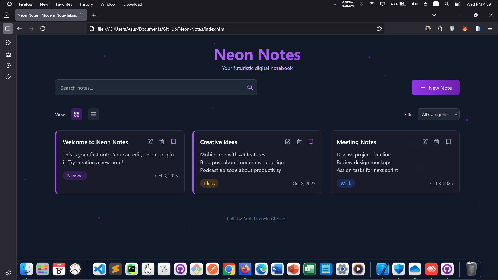

<!-- README.md -->

  <a href="https://amirhosseingholami-dev.github.io/Neon-Notes/" target="_blank" style="text-decoration: none; color: inherit;">
    
    <h3>Neon Notes</h3>
  </a>

  A sleek, responsive note-taking app with neon aesthetics and futuristic UI.  
  Built with Tailwind CSS and vanilla JavaScript.  
  Features: search, category filtering, grid/list views, pinning, and modal-based note management.  
  No frameworks — just pure HTML/CSS/JS.

  <a href="https://amirhosseingholami-dev.github.io/Neon-Notes/" target="_blank">🎯 Live demo</a> ·
  <a href="https://github.com/AmirHosseinGholami-DEV/Neon-Notes/" target="_blank">💻 Source</a>

